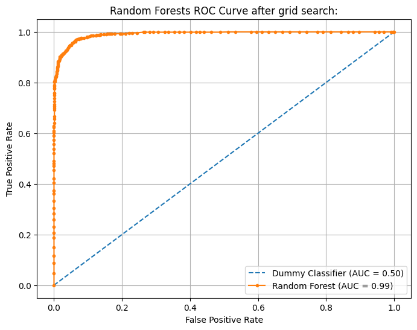
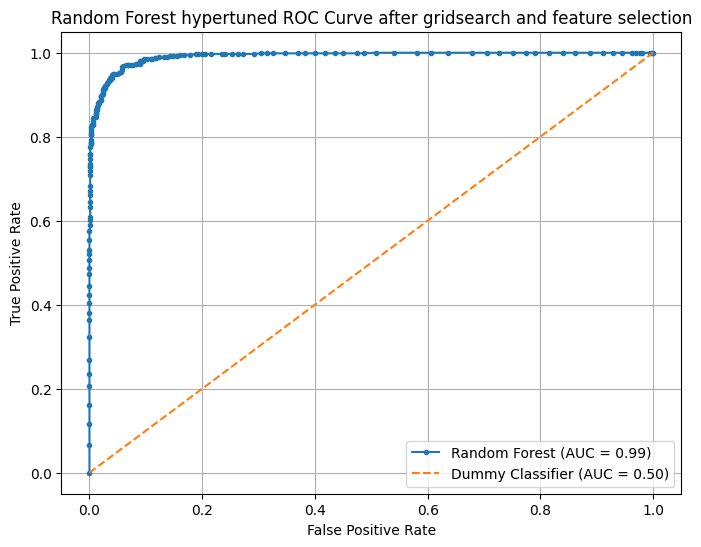

### Overview:

In this project, we're building a classifier to predict customer churn for SyriaTel, a telecommunications company. By analyzing customer behavior data, our goal is to identify patterns that indicate whether a customer is likely to discontinue their services soon. With a focus on binary classification, our aim is to help SyriaTel reduce revenue loss by enabling proactive retention strategies. Through this analysis, we seek to uncover actionable insights to optimize customer retention efforts and enhance profitability.

### Business Understanding:

SyriaTel, a telecom company, aims to address customer churn by implementing predictive analytics. Using historical data on demographics, usage patterns, and service interactions, I develop a binary classifier model. This model predicts churn likelihood in real-time, allowing SyriaTel to target at-risk customers with personalized retention strategies. Ultimately, this approach optimizes marketing efforts, enhances customer retention, and boosts profitability.

### Data Understanding:

In preparation for predictive modeling (logistic regression, random forests) for churn prediction at SyriaTel, historical customer data is collected, covering demographics, usage patterns, subscriptions, and service interactions. The dataset undergoes thorough exploration, feature identification, and preprocessing to handle missing values and categorical variables. After splitting the data into training and testing sets, logistic regression and random forests are trained and evaluated using accuracy and F1 score metrics. Model optimization fine-tunes hyperparameters to improve predictive performance, ensuring robustness and interpretability. This approach provides SyriaTel with insights into churn drivers and facilitates effective implementation of targeted retention strategies.

### Data Analysis:

### Evaluation:

The F1 score was chosen for its ability to balance recall and precision, crucial in predicting customer churn. By optimizing this metric, the selected model achieves equilibrium between capturing true positives and minimizing false alarms, enhancing its effectiveness in real-world scenarios where both precision and recall are essential considerations. The comprehensive evaluation reveals the superiority of the optimized random forest model over other models like the baseline logistic regression and random forest baseline models. Leveraging robust feature selection, including account length, international plan status, and voicemail usage, the model provides valuable insights into churn drivers. With a weighted average precision, recall, and accuracy of 95% and an impressive F1 score of 95%, the model outperforms logistic regression models by 5% across all metrics. Furthermore, the optimized random forest model demonstrates superior discriminative ability with an AUC of 99%, significantly higher than the logistic regression model's 96%. In summary, deploying the optimized random forest model enables SyriaTel to proactively address churn risk, implement targeted retention strategies, and improve customer satisfaction and loyalty.

### Conclusions:

The optimized random forest model outperformed other models in predicting customer churn, boasting a weighted average precision, recall, and accuracy of 95% and an F1 score of 95%. Compared to logistic regression, which scored 90% in all metrics, the optimized random forest model showed a 5% improvement. Additionally, its AUC of 99% surpassed logistic regression's 96%, reinforcing its superiority. Hence, the optimized random forest model is the recommended choice for predicting customer churn.
